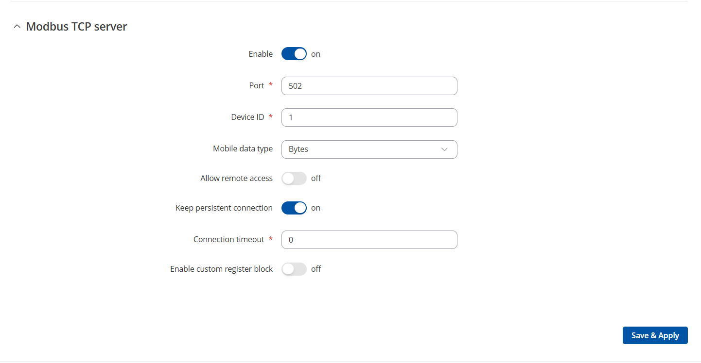

# Teltonika over ModBUS

ModBUS is a protocol used often to control devices. Control in this case means Read and Write. 

This implementation looks at reading values only. For future this can change to writing also. I am investigating this.

I would love to get rid of these parts. I think MQTT is much more resiliant to changes in the future. I do know that Teltonika can send ModBUS over MQTT also. That might an option too. 

Please follow my blog to find out if I was able to achieve this.

## Configure the Router

Set it up like this. No more requirements here!

## In this Folder

In this folder you will find a few files. They should be self explainory:
  - scripts/teltonika-modbus.yaml should be uploaded to your homeassistant/scripts folder. If that folder does not exist, create it.
  - configuration.yaml needs to be added to the configuration.yaml on your installation
  - dashboard.yaml contains an example dashboard. You should import it in raw mode on a dashboard page.
  